# DevOps - final project

Projet final de DevOps qui regroupe l'ensemble du travail effectué ce semestre

## Usage

*how to start and use the application, run the tests, ...*

* Clone this repository, from your local machine:
  ```
  git clone https://github.com/Cambelau/DevopsRepo/project.git devopsRepo
  cd DevopsRepo/project
  ```

## Author

👤 **Matthieu Sajot**

* Github: [@Cambelau](https://github.com/Cambelau)
* Email: matthieu.sajot@edu.ece.fr

👤 **Théo**
//a remplir
* Github: [@](https://github.com/)
* Email: @edu.ece.fr

## Tasks

### 1. Create a web application

To run the app :
  ``    npm run start ``
  ``    cd userapi/redis-6.2.6
        src/redis-server
  ``

  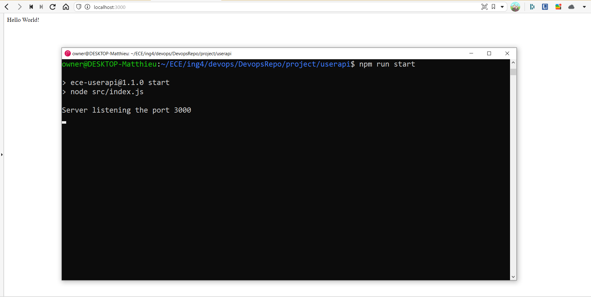
  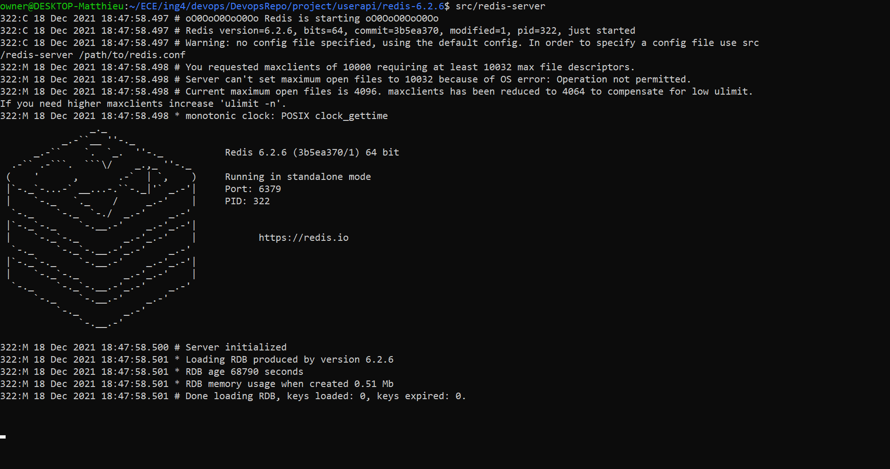

### 2. Apply CI/CD pipeline

Check the github actions
<br/>

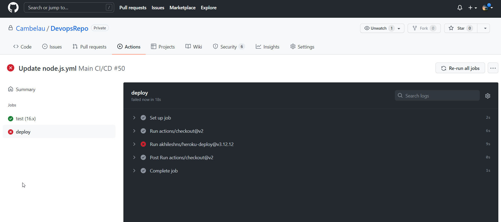
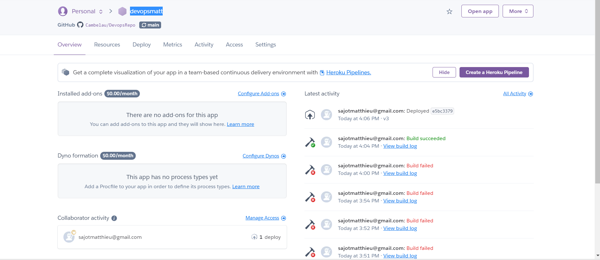

### 3. Configure and provision a virtual environment and run your application using the IaC approach
<br/>
Nous avons rencontré des problèmes de compatibilité entre WSL et Windows. Nous avons essayé avec 2 vagrantfile différents.
<br/>Le second est dans le dossier   `iac/other `
<br/>Voila la documentation qui montre que vagrant ne fonctionne pas avec WSL : https://www.vagrantup.com/docs/other/wsl
<br/>
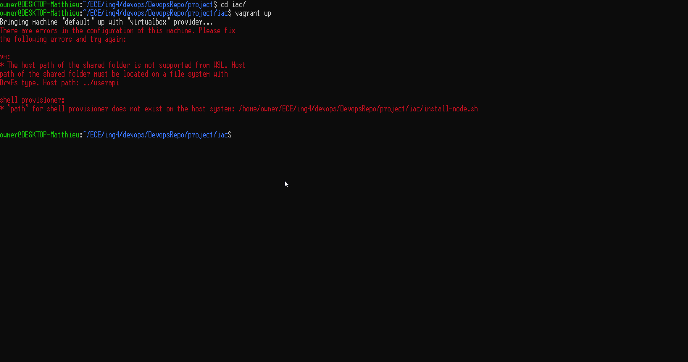
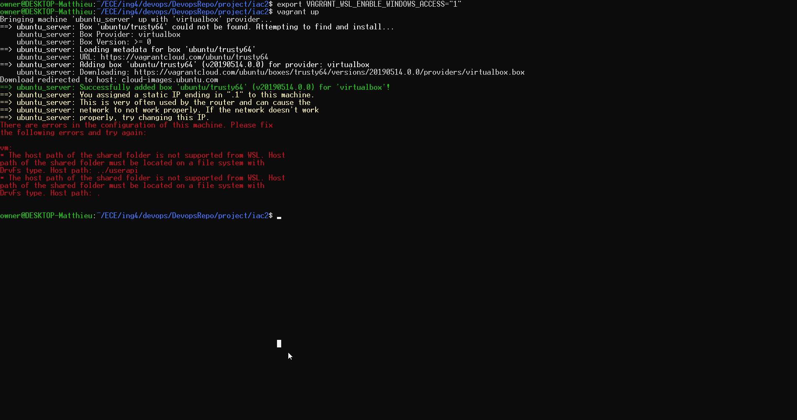
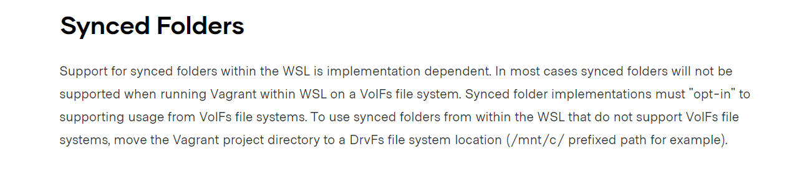

### 4. Build Docker image of your application
<br/>

  ``  docker build -t app .  ``  
  ``   docker run -dp 3000:3000 app  ``  
  <br/>
<br/> The image is push on docker up named "1598415/devopsrepo2021"<br/>
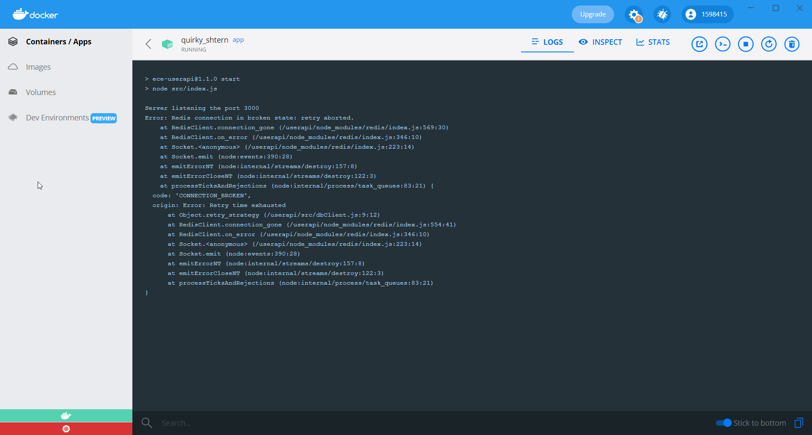


### 5. Make container orchestration using Docker Compose

To run dockercompose :   ``  docker-compose up -d ``  

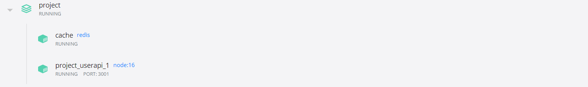

### 6. Make docker orchestration using Kubernetes

 ``  kubectl apply -f deployment.yaml``  
``   kubernetes-bootcamp``  
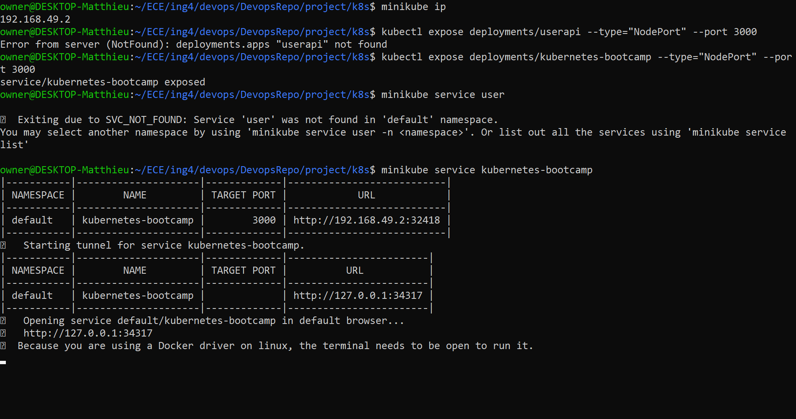
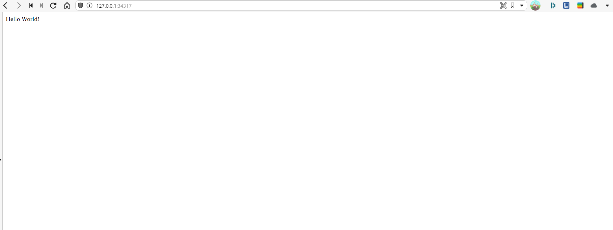
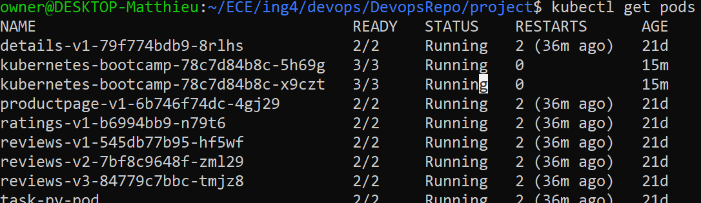

### 7. Make a service mesh using Istio
### 8. Implement Monitoring to your containerized application

## Bonus

*place your graduation and comments*
